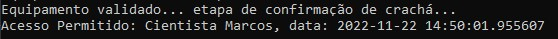
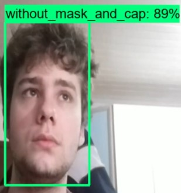
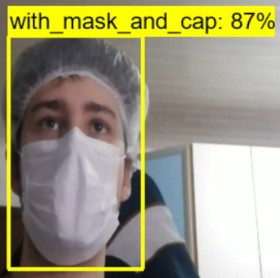

# Detector de máscara e touca descartável para acesso à laboratórios/salas de operações

## Propósito
---
Resumidamente o propósito deste projeto foi garantir a entrada de profissionais em laboratórios ou salas de operações que requerem o equipamento correto para a liberação de sua entrada.  
Em mais detalhes, desenvolvemos um algoritmo simples para simular um sistema, por vídeo, que detecta o equipamento correto necessário para a entrada (máscara e touca descartável), juntamente com a detecção do cracha do profissional via QRcode e a cor correta que o cracha deve apresentar para entrar em determinado lugar.

## Tecnologias utilizadas
---
### Principais tecnologias
<p float="left">
    
    
    
</p>

#### Pacotes
> [Lista de requerimentos](requirements.txt)

#### Ferramentas

> [Visual Studio Code](https://code.visualstudio.com/)  
> [Jupyter Notebook](https://jupyter.org/)  
> [labelImg](https://github.com/heartexlabs/labelImg)

## Instalação
> Aviso 1: Instalação e Setup somente para Windows  
> Aviso 2: **Recomendado** criar um ambiente virtual do Python após sua instalação

Clonar este repositório  
> 1. git clone https://github.com/RhodrigoLopesPicinini/required-equipment-detector.git

Instalar Python 3.9.10  
> 1. [Python 3.9.10](https://www.python.org/downloads/release/python-3910/)  

Instalar Microsoft Visual Studio C++ Build Tools   
> 1. [Microsoft Visual Studio](https://visualstudio.microsoft.com/pt-br/vs/community/)
> 2. Workload: Desktop Development with C++   

Instalar Protocol Buffers  
> 1. [Protocol Buffers 3.14.0](https://github.com/protocolbuffers/protobuf/releases/tag/v3.14.0)  
> 2. Descompactar o arquivo protoc-3.14.0
> 3. Seguir e copiar o path: X:\protoc\bin  
> 4. Adicionar às variáveis de ambiente

Instalar TensorFlow Object Detection API  
> 1. Insira a pasta [models](https://github.com/tensorflow/models) dentro do repositório clonado
> 2. Abra um terminal dentro da pasta
> 3. Vá para: ..\models\research\
> 4. Execute: protoc object_detection/protos/*.proto --python_out=.  
> 5. Execute: copy ..\models\research\packages\tf2\setup.py .
> 6. Execute: python -m pip install .

Instalar os pacotes restantes  
> 1. python3 -m venv /path/to/new/virtual/environment
> 2. pip install -r requirements.txt  

Tudo feito. 

## Utilização
---
Após a instalação estiver concluída...  
> 1. Vá para a pasta clonada deste repositório
> 2. Certifique-se de possuir uma câmera ativa
> 3. Execute o arquivo [detection.py](detection.py)  
```vim
    python detection.py
```

## Requisitos do projeto
---   

- Print do log do terminal 
>   

- Prints do reconhecimento facial  
> 
>   

- Vídeo demonstrativo do algoritmo
> https://youtu.be/nLw2Z6Uyq68


## Colaboradores/Integrantes
---
Autores: Rhodrigo Lopes Picinini (1125147) e Tomás Biasotto (1125129)
Colaborador: Marcos R. Santos

## Referência/Fontes
---
Repositório utilizado para o treino de detecção via TensorFlow Object Detection API:
https://github.com/nicknochnack/RealTimeObjectDetection

Repositório utilizado para a rotulação das imagens de treino:
https://github.com/heartexlabs/labelImg

Repositório para a instalação das dependências do Tensorflow Object Detection API:
https://github.com/tensorflow/models
